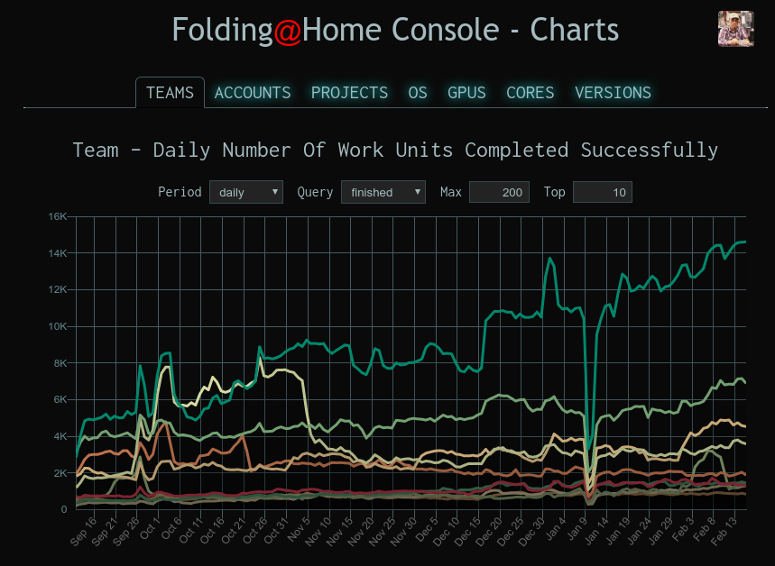

Folding@home Console
====================

The Folding@home Console is a Web app for tracking activity on the Folding@home
network.  It consists of historical charts, top 100 lists and pages about
individual teams and accounts.  Many more features are planed.

# Historical Charts
Charts allow you to view historical data measured hourly, daily, weekly or
monthly for teams, individual accounts, projects, operating systems, GPUs,
folding cores or client software versions.  Charts can show credits earned,
average completion time or various Work Units (WU) assignment or completion
statistics.

# Top 100 Lists
The top lists show rankings for the last hour, day, week or month including
credit earned, average WU completion time, number of assigned, errored and
finished WUs as well as the ratio of finished vs. assigned WUs for the period.

# Team & Account Pages
Links to individual teams or accounts in charts or top lists leads to team and
account pages.  Here you can view charts, recently returned WUs and for
accounts, recently active machines.

# Account login
Logging in with a Google account will allow you to set your user name, team and
passkey.  It will also provide easy access to your team and account pages via a
menu in the top right of the screen.  More account specific features will be
added later.

# Upcoming Features
 * Monitor and control your clients.
 * Visualize proteins in 3D.
 * Earn social media points by promoting Folding@home.
 * Learn about the projects running on Folding@home.
 * Create new teams.
 * Edit team settings.
 * Monitor Work Server status.
 * Monitor your bonus status.
 * Change your Folding@home avatar.
